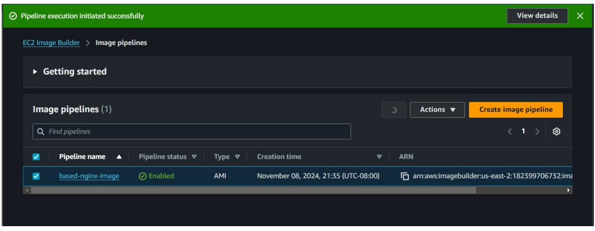

# EC2 Image Builder Lab

Objective 

1. Create Image Builder Pipelines for Nginx on Ubuntu image

2. Use Custom Component to build Nginx

3. Submit with the SS of Successful Pipeline

Step 1 : Build the image pipeline in EC2 Image Builder.

Step 2 : Run the image pipeline and Build Instance for nginx-based-image is being run in EC2.

Workflow for based-image is being processed.

All work flows for based-image are completed.

Workflows for test-image are now being processed.

Instance state of Test instance for nginx-based image is running state.

All workflows for Test-image are now completed.

AMI for nginx-based has been created 

Run the instance by using the created AMI from image builder pipeline.

Nginx server has already been running state in running instance.

