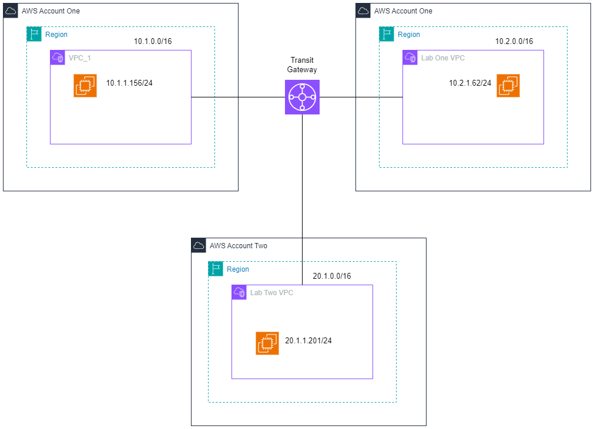

# Transit Gateway

Lab Objective 

<aside>
☁️

Setup AWS organization and SSO with IAM identity center

Create new account under organization

Create new VPC (lab-one) in main account

Create new VPC (lab-two) in sub account

Create instances in

- main account's default VPC
- main account's lab-one VPC
- sub account't lab-two VPC

Create Transit Gateway and three attachments

Update route tables in each VPC

ping each instance with private IP.

Delete your test resources

</aside>

# Lab Diagram



# Section 1 : Create New Account under AWS Organization

Step 1: Set up AWS Organization and SSO with IAM identity center 


We create the soeyehtet_test account under soeyehtet_study management account [Main account]. 

 


We create the admin_user and will use that user name to create the “Lab Two VPC”. 

Step 2: Log-in the AWS environment via admin_user with newly created account which is soeyehtet_test [Main Account].


# Section 2 : VPC and Instances

Step 3 : Create two VPCs with soeyehtet_study account [main account] and Launch instances in those two VPCs. 

Create VPC with the name VPC_1 with 1 public subnet.


VPC IPV4 CIDR ⇒ 10.1.0.0/16

public subnet ⇒ 10.1.1.0/24


Create VPC with the name Lab-One VPC with 1 public subnet


VPC IPV4 CIDR ⇒ 10.2.0.0/16

public subnet ⇒ 10.2.1.0/24

Step 4 : Launch Instances in VPC_1 and Lab-One VPC VPCs

Create security group with the name transitgw_lab_sg_vpc_1 and allow SSH and ICMP.


Launch Instance in VPC_1 


Instance IP Addresses are

public IP address = 3.94.153.244

private IP address = 10.1.1.156

Create security group with the name transitgw_lab_sg_lab_one and allow SSH and ICMP.


Launch Instance in lab_one VPC. 


Instance IP Addresses are 

public IP address = 54.160.13.166

private IP address = 10.2.1.62

Step 5 : Create one VPC with soeyehtet_test account and Launch instances in that VPC. 

Step 5.1 : Create VPC with the name Lab Two VPC with 1 public subnet


Create security group with the name transitgw_lab_sg_lab_two and allow SSH and ICMP.


Launch Instance in lab_two VPC. 


Instance IP Addresses are

public IP address = 204.236.207.92

private IP address = 20.1.1.201

# Section 3 : Transit Gateway

Step 6 : Create one Transit Gateway in soeyehtet_study account [Main Account]. 


We are going to ping instance from VPC to instance from Lab One VPC [From 10.1.1.156 to 10.2.1.62]

As expected, there is a 100% packet loss.


Now we are going to create transit gateway attachment for vpc one with the name transit_gw_attachment_vpc_one. 


Now we are going to create transit gateway attachment for lab_one with the name transit_gw_attachment_lab_one. 


> We also need to add the flow rules in each instance’s route table to route traffic
> 

For VPC_1 route table 


For Lab_One Route table 


We are going to ping again instance from VPC_One VPC to instance from Lab One VPC [From 10.1.1.156 to 10.2.1.62]


```reason
[ec2-user@ip-10-1-1-156 ~]$ ping 10.2.1.62
PING 10.2.1.62 (10.2.1.62) 56(84) bytes of data.
64 bytes from 10.2.1.62: icmp_seq=1 ttl=126 time=4.28 ms
64 bytes from 10.2.1.62: icmp_seq=2 ttl=126 time=1.43 ms
64 bytes from 10.2.1.62: icmp_seq=3 ttl=126 time=1.09 ms
64 bytes from 10.2.1.62: icmp_seq=4 ttl=126 time=1.41 ms
64 bytes from 10.2.1.62: icmp_seq=5 ttl=126 time=0.970 ms
64 bytes from 10.2.1.62: icmp_seq=6 ttl=126 time=1.54 ms
64 bytes from 10.2.1.62: icmp_seq=7 ttl=126 time=1.33 ms
64 bytes from 10.2.1.62: icmp_seq=8 ttl=126 time=1.21 ms
64 bytes from 10.2.1.62: icmp_seq=9 ttl=126 time=1.58 ms
64 bytes from 10.2.1.62: icmp_seq=10 ttl=126 time=1.24 ms
^C
--- 10.2.1.62 ping statistics ---
10 packets transmitted, 10 received, 0% packet loss, time 9014ms
rtt min/avg/max/mdev = 0.970/1.609/4.283/0.909 ms
[ec2-user@ip-10-1-1-156 ~]$ 
```

We can also ping from 10.2.1.62 to 10.1.1.156.

```reason
[ec2-user@ip-10-2-1-62 ~]$ ping 10.1.1.156
PING 10.1.1.156 (10.1.1.156) 56(84) bytes of data.
64 bytes from 10.1.1.156: icmp_seq=1 ttl=126 time=1.22 ms
64 bytes from 10.1.1.156: icmp_seq=2 ttl=126 time=0.881 ms
64 bytes from 10.1.1.156: icmp_seq=3 ttl=126 time=1.78 ms
64 bytes from 10.1.1.156: icmp_seq=4 ttl=126 time=1.57 ms
64 bytes from 10.1.1.156: icmp_seq=5 ttl=126 time=0.929 ms
64 bytes from 10.1.1.156: icmp_seq=6 ttl=126 time=0.819 ms
64 bytes from 10.1.1.156: icmp_seq=7 ttl=126 time=0.810 ms
64 bytes from 10.1.1.156: icmp_seq=8 ttl=126 time=0.885 ms
64 bytes from 10.1.1.156: icmp_seq=9 ttl=126 time=1.43 ms
64 bytes from 10.1.1.156: icmp_seq=10 ttl=126 time=0.849 ms
64 bytes from 10.1.1.156: icmp_seq=11 ttl=126 time=0.718 ms
^C
--- 10.1.1.156 ping statistics ---
11 packets transmitted, 11 received, 0% packet loss, time 10151ms
rtt min/avg/max/mdev = 0.718/1.080/1.778/0.342 ms
```

Therefore, thanks to the “Transit Gateway” we can now ping from VPC_1 to Lab One VPC [Within Main Account] 


We are now trying to connect with the instance under Lab Two VPC which is at different AWS account. 

In order to connect the VPCs which are from two different AWS account. We need to share the transit gateway.


We create the share resource [resource ID = transit gateway ID].

In sub AWS account at resource access manager, we accept the shared resource.


> I forgot to take the screenshot, we need to modify the route table of lab_two VPC. The rules to route to the transit gateway if the destination IP addresses are 10.1.0.0/16 and 10.2.0.0/16

Route 1
=====
Destination = 10.1.0.0/16, Target = tgw-id

Route 2
=====
Destination = 10.2.0.0/16, Target = tgw-id
> 

After modifying the route table at lab_two VPC, instance at each VPC can now ping to each other 

Evidence 1. 


```reason
[ec2-user@ip-20-1-1-201 ~]$ ping 10.1.1.156 -c 5
PING 10.1.1.156 (10.1.1.156) 56(84) bytes of data.
64 bytes from 10.1.1.156: icmp_seq=1 ttl=126 time=3.30 ms
64 bytes from 10.1.1.156: icmp_seq=2 ttl=126 time=1.18 ms
64 bytes from 10.1.1.156: icmp_seq=3 ttl=126 time=1.04 ms
64 bytes from 10.1.1.156: icmp_seq=4 ttl=126 time=1.88 ms
64 bytes from 10.1.1.156: icmp_seq=5 ttl=126 time=1.43 ms

--- 10.1.1.156 ping statistics ---
5 packets transmitted, 5 received, 0% packet loss, time 4005ms
rtt min/avg/max/mdev = 1.044/1.765/3.304/0.820 ms
[ec2-user@ip-20-1-1-201 ~]$ ping 10.2.1.62 -c 5
PING 10.2.1.62 (10.2.1.62) 56(84) bytes of data.
64 bytes from 10.2.1.62: icmp_seq=1 ttl=126 time=2.42 ms
64 bytes from 10.2.1.62: icmp_seq=2 ttl=126 time=1.91 ms
64 bytes from 10.2.1.62: icmp_seq=3 ttl=126 time=1.36 ms
64 bytes from 10.2.1.62: icmp_seq=4 ttl=126 time=1.59 ms
64 bytes from 10.2.1.62: icmp_seq=5 ttl=126 time=1.73 ms

--- 10.2.1.62 ping statistics ---
5 packets transmitted, 5 received, 0% packet loss, time 4006ms
rtt min/avg/max/mdev = 1.357/1.799/2.416/0.357 ms
[ec2-user@ip-20-1-1-201 ~]$ 
```

Evidence 2 


```reason
[ec2-user@ip-10-1-1-156 ~]$ ping 10.2.1.62 -c 5
PING 10.2.1.62 (10.2.1.62) 56(84) bytes of data.
64 bytes from 10.2.1.62: icmp_seq=1 ttl=126 time=1.44 ms
64 bytes from 10.2.1.62: icmp_seq=2 ttl=126 time=1.94 ms
64 bytes from 10.2.1.62: icmp_seq=3 ttl=126 time=1.50 ms
64 bytes from 10.2.1.62: icmp_seq=4 ttl=126 time=0.992 ms
64 bytes from 10.2.1.62: icmp_seq=5 ttl=126 time=1.19 ms

--- 10.2.1.62 ping statistics ---
5 packets transmitted, 5 received, 0% packet loss, time 4006ms
rtt min/avg/max/mdev = 0.992/1.413/1.944/0.322 ms
[ec2-user@ip-10-1-1-156 ~]$ ping 20.1.1.201 -c 5
PING 20.1.1.201 (20.1.1.201) 56(84) bytes of data.
64 bytes from 20.1.1.201: icmp_seq=1 ttl=126 time=1.98 ms
64 bytes from 20.1.1.201: icmp_seq=2 ttl=126 time=1.52 ms
64 bytes from 20.1.1.201: icmp_seq=3 ttl=126 time=1.16 ms
64 bytes from 20.1.1.201: icmp_seq=4 ttl=126 time=1.00 ms
64 bytes from 20.1.1.201: icmp_seq=5 ttl=126 time=1.20 ms

--- 20.1.1.201 ping statistics ---
5 packets transmitted, 5 received, 0% packet loss, time 4006ms
rtt min/avg/max/mdev = 1.002/1.371/1.976/0.345 ms
[ec2-user@ip-10-1-1-156 ~]$ 
```

Evidence 3 


```reason
[ec2-user@ip-10-2-1-62 ~]$ ping 10.1.1.156 -c 5
PING 10.1.1.156 (10.1.1.156) 56(84) bytes of data.
64 bytes from 10.1.1.156: icmp_seq=1 ttl=126 time=1.22 ms
64 bytes from 10.1.1.156: icmp_seq=2 ttl=126 time=0.913 ms
64 bytes from 10.1.1.156: icmp_seq=3 ttl=126 time=1.24 ms
64 bytes from 10.1.1.156: icmp_seq=4 ttl=126 time=1.02 ms
64 bytes from 10.1.1.156: icmp_seq=5 ttl=126 time=0.921 ms

--- 10.1.1.156 ping statistics ---
5 packets transmitted, 5 received, 0% packet loss, time 4003ms
rtt min/avg/max/mdev = 0.913/1.062/1.242/0.142 ms
[ec2-user@ip-10-2-1-62 ~]$ ping 20.1.1.201 -c 5
PING 20.1.1.201 (20.1.1.201) 56(84) bytes of data.
64 bytes from 20.1.1.201: icmp_seq=1 ttl=126 time=1.72 ms
64 bytes from 20.1.1.201: icmp_seq=2 ttl=126 time=3.17 ms
64 bytes from 20.1.1.201: icmp_seq=3 ttl=126 time=1.07 ms
64 bytes from 20.1.1.201: icmp_seq=4 ttl=126 time=1.61 ms
64 bytes from 20.1.1.201: icmp_seq=5 ttl=126 time=1.13 ms

--- 20.1.1.201 ping statistics ---
5 packets transmitted, 5 received, 0% packet loss, time 4007ms
rtt min/avg/max/mdev = 1.068/1.740/3.170/0.760 ms
[ec2-user@ip-10-2-1-62 ~]$ 
```

Last but not least, we delete all the resource we create for this lab.