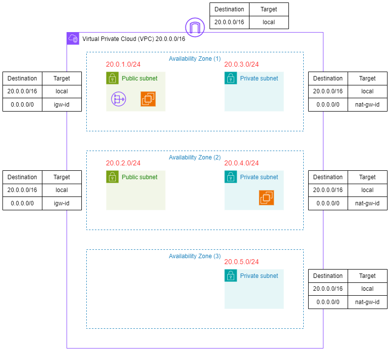
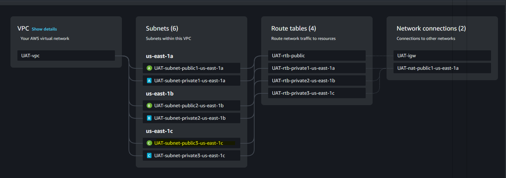

# VPC Assignment

Objective 

1. Create A VPC with two public subnets and 3 private subnets

2. Create 3 route table for private subnets and 1 public rtb.

3. 1 IGW and 1NAT

4. Submit with details setup and infrastructure diagram

5. Create EC2 instance in one of public subnet

Name - Soe Ye Htet

Lab Diagram 



Number of public subnet = 2 [20.0.1.0/24, 20.0.2.0/24]

Number of private subnet = 3 [20.0.3.0/24, 20.0.4.0/24, 20.0.5.0/24]

Number of EC instances = 2 [1 in public subnet, 1 in private subnet]

Number of public route table = 1 

Number of private route table = 3

Number of Internet Gateway = 1

Number of NAT Gateway = 1

Number of Availability zone = 3

<aside>
☁️

## Step 1 : Create the VPC in N. Virginia [us-east-1] with the name UAT-VPC

</aside>



Remark : UAT-subnet-public3-us-east-1c subnet will be deleted as the objective is to create only 2 public subnets. 

VPC in us-east-1 region has now been created. 


<aside>
☁️

## Step 2 : Delete the extra public subnet [due to lab objective]

</aside>


<aside>
☁️

## Step 3 : Verify the resources

</aside>

## Subnet


The number of private subnets are “3” and the number of public subnets are two in UAT-VPC.

## Route Tables


The number of private route tables are “3” and the number of public route table is “1”. 

## Private subnets


As we can see, all outbound traffic [exclude : 20.0.0.0/16] from each private subnets are routed to NAT Gateway.

## Public subnets


As we can see, all outbound traffic [exclude : 20.0.0.0/16] from each public subnets are routed to Internet Gateway.

## NAT Gateway


NAT Gateway is created at 20.0.1.0/24 subnet 

<aside>
☁️

## Step 4 : Create the security group for UAT-VPC

</aside>


In sg_uat_vpc security group, all ICMP and SSH Traffic is allowed in inbound rules for testing purpose [not recommended for security issue],


<aside>
☁️

## Step 5 : Launch instance in one public subnet and one private subnet

</aside>

An instance with the name [public_instance_1] in launched in UAT_VPC at us-east-1a. The private IP address for that instance is 20.0.1.33/24 which is public subnet as 20.0.1.0/24 network is public subnet whereas the public IP address for that one is 58.80.48.115.


As we allow the ICMP traffic in sg_uat_vpc security group, we can ping 58.80.48.115 from my local host.

An instance with the name [private_instance_1] in launched in UAT_VPC at us-east-1b. The private IP address for that instance is 20.0.4.129/24 which is private subnet as 20.0.4.0/24 network is private subnet whereas the auto assigned public address for that one is 100.29.190.91.


Since private_instance_1 is launched with private subnet, local machine cannot ping to private instance. In order to test the NAT gateway connectivity, we put the key file with .pem file extension to public instance and will connect remote to private instance from public instance 


```reason
[ec2-user@ip-20-0-1-33 ~]$ ssh -i "soeyehtet.pem" ec2-user@ec2-100-29-190-91.compute-1.amazonaws.com
   ,     #_
   ~\_  ####_        Amazon Linux 2023
  ~~  \_#####\
  ~~     \###|
  ~~       \#/ ___   https://aws.amazon.com/linux/amazon-linux-2023
   ~~       V~' '->
    ~~~         /
      ~~._.   _/
         _/ _/
       _/m/'
Last login: Fri Dec  6 08:22:51 2024 from 20.0.1.33
```

Now we can successfully login to private instance from public instace. 

We will ping to “www.google.com” from private instance. [10.0.4.0/24 subnet is private subnet]


```reason
[ec2-user@ip-20-0-4-129 ~]$ ping www.google.com
PING www.google.com (142.251.111.105) 56(84) bytes of data.
64 bytes from bk-in-f105.1e100.net (142.251.111.105): icmp_seq=1 ttl=105 time=2.62 ms
64 bytes from bk-in-f105.1e100.net (142.251.111.105): icmp_seq=2 ttl=105 time=2.24 ms
64 bytes from bk-in-f105.1e100.net (142.251.111.105): icmp_seq=3 ttl=105 time=2.69 ms
64 bytes from bk-in-f105.1e100.net (142.251.111.105): icmp_seq=4 ttl=105 time=2.84 ms
64 bytes from bk-in-f105.1e100.net (142.251.111.105): icmp_seq=5 ttl=105 time=2.80 ms
64 bytes from bk-in-f105.1e100.net (142.251.111.105): icmp_seq=6 ttl=105 time=2.50 ms
64 bytes from bk-in-f105.1e100.net (142.251.111.105): icmp_seq=7 ttl=105 time=2.40 ms
64 bytes from bk-in-f105.1e100.net (142.251.111.105): icmp_seq=8 ttl=105 time=2.53 ms
64 bytes from bk-in-f105.1e100.net (142.251.111.105): icmp_seq=9 ttl=105 time=2.43 ms
64 bytes from bk-in-f105.1e100.net (142.251.111.105): icmp_seq=10 ttl=105 time=2.77 ms
64 bytes from bk-in-f105.1e100.net (142.251.111.105): icmp_seq=11 ttl=105 time=2.24 ms
64 bytes from bk-in-f105.1e100.net (142.251.111.105): icmp_seq=12 ttl=105 time=2.69 ms
64 bytes from bk-in-f105.1e100.net (142.251.111.105): icmp_seq=13 ttl=105 time=2.45 ms
64 bytes from bk-in-f105.1e100.net (142.251.111.105): icmp_seq=14 ttl=105 time=2.77 ms
```

Thanks to the NAT, the private instance can ping to www.google.com.

<aside>
☁️

## Step 6 : Clear the resources

</aside>

Last but not least, please clear all the resources you have launched.