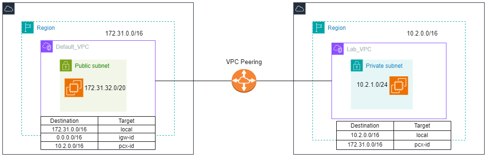

# VPC Peering

Lab Objective 

1. Setup lab vpc
2. Create VPC peering within Default VPC and Lab VPC
3. Setup appropriate route table
4. Create bastion host in public subnet - Default VPC
5. Create Main host in private subnet - Lab VPC use ALL ICMP allow SG from Default VPC.
6. Login to Bastion host and Ping to Main host private IP

# Lab Diagram



## Step 1 : Create VPC

There is a default VPC in us-east-1 region where the default VPC is vpc-012cc4199aa605f78 and we will use 172.31.32.0/20 public subnet.


We now create the Lab VPC with 1 private subnet without [NAT Gateway]. 


## Step 2 : Create VPC Peering Connection


Request VPC = Default VPC 

Accepter VPC = LAB VPC 

We will accept the request in order to establish VPC Peering Connection. 


The VPC Peering connection status is now “Active” 


## Step 3 : Modifying Route Table

Although VPC Peering has been set up, we need to modify route table in order to establish the connection between two VPCs. 

<aside>
👉🏻

In Default VPC

</aside>


<aside>
👉🏻

In LAB VPC

</aside>


## Step 4 : Launch Bastion Host in Default VPC

Create the security group for bastion host and allow SSH and ICMP Traffic.


Launch Bastion host in default VPC. 


The IP Addresses for bastion host are 

Public IP = 98.82.33.209

Private IP = 172.31.38.94

## Step 5 : Launch Main Host in LAB VPC

Create the security group for main host and allow SSH and ICMP Traffic.


Launch the main host in LAB VPC with private subnet.


Private IP Address = 10.2.1.131

## Step 6 : Log-in to the Bastion Host and test the connectivity

We now log-in to the Bastion Host and ping 10.2.1.131 which is IP Address of main host.


 

```reason
[ec2-user@ip-172-31-38-94 ~]$ ping 10.2.1.131 -c 10
PING 10.2.1.131 (10.2.1.131) 56(84) bytes of data.
64 bytes from 10.2.1.131: icmp_seq=1 ttl=127 time=0.700 ms
64 bytes from 10.2.1.131: icmp_seq=2 ttl=127 time=0.968 ms
64 bytes from 10.2.1.131: icmp_seq=3 ttl=127 time=0.334 ms
64 bytes from 10.2.1.131: icmp_seq=4 ttl=127 time=0.854 ms
64 bytes from 10.2.1.131: icmp_seq=5 ttl=127 time=0.622 ms
64 bytes from 10.2.1.131: icmp_seq=6 ttl=127 time=0.627 ms
64 bytes from 10.2.1.131: icmp_seq=7 ttl=127 time=0.441 ms
64 bytes from 10.2.1.131: icmp_seq=8 ttl=127 time=0.575 ms
64 bytes from 10.2.1.131: icmp_seq=9 ttl=127 time=0.614 ms
64 bytes from 10.2.1.131: icmp_seq=10 ttl=127 time=0.968 ms

--- 10.2.1.131 ping statistics ---
10 packets transmitted, 10 received, 0% packet loss, time 9323ms
rtt min/avg/max/mdev = 0.334/0.670/0.968/0.198 ms
[ec2-user@ip-172-31-38-94 ~]$ 
```

If we delete the following rule from the route table of LAB VPC, we will see we cannot ping anymore from the bastion host to main host. 

Deleted Route ⇒ Destination, 172.31.0.0/16, Target = pcx-id


```reason
[ec2-user@ip-172-31-38-94 ~]$ ping 10.2.1.131 -c 10
PING 10.2.1.131 (10.2.1.131) 56(84) bytes of data.

--- 10.2.1.131 ping statistics ---
10 packets transmitted, 0 received, 100% packet loss, time 9339ms
```

Last but not least, we delete the resources that we create for this lab. 

# Thank you so much